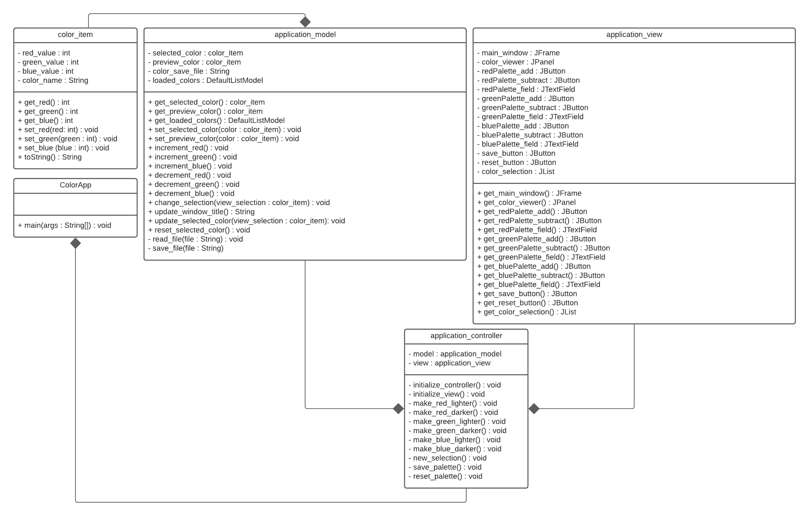
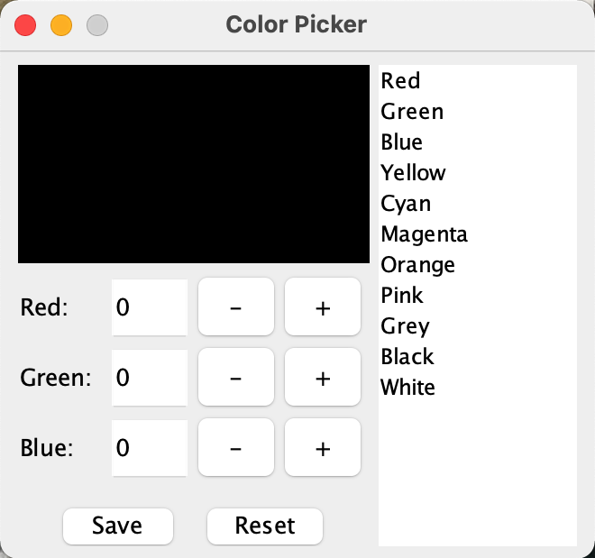
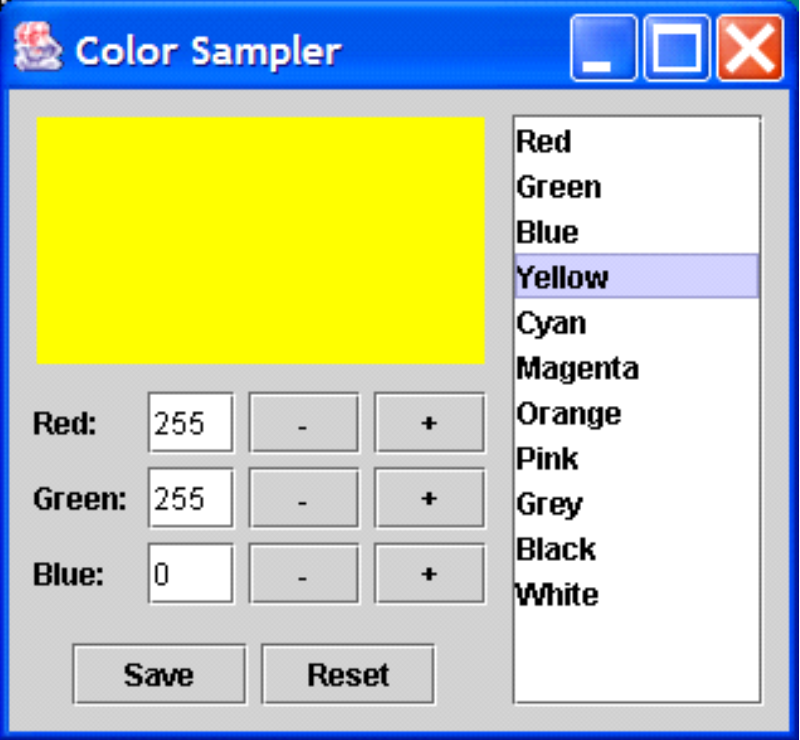

# Java Color Picker
The Java Color Picker was a project created for Comptuer Languages and Implemention course. The project demonstrates use of Java, Java File I/O, and the Swing User Interface library to create a Color Sampler application. The application uses the Model-View-Controller (MVC) Design Pattern to encapsulate the application's business logic and user interface componenets for maintainability of the application. 

## Application Organization

The business logic of the application is encapsulated within the `application_model` class and user interface components are encapsulated in the `application_view` class. For now on within the documentation the business logic will be referred as **Model** and the user interface components will be referred as **View**. The `application_controller` class is used by the View and Model to communicate events between the two classes. Figure 1 represents the relationship between the three classes. 

 Fig 1. UML of the application. 
 

## Application Operation
Components the View wishes to open to the Model for processing of events such as mouse-clicks must be exposed through *getter* methods. Once the View component is exposed, the component must be "registered" with the application's `application_controller` class in which the event is defined with the event behaviour. The event behaviour is defined by a called method within the application Model.  

## Side-by-side Comparison of Color Samplers 

 

